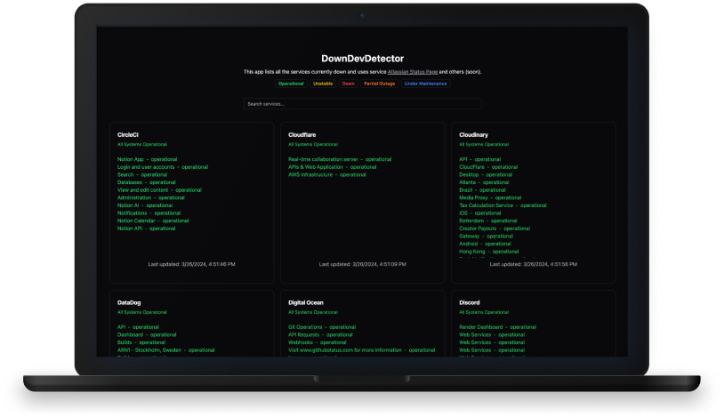

<strong><h1 align="center">DownDevDetector</h1></strong>

  

## 🚀 Description

- [Click here](https://downdevdetector.vercel.app/) to preview all the incidents
- List all the services that are currently down
- Search for any service by name on the list

## 🌟 How to use

- Clone the repository
- Run `pnpm install`
- Run `pnpm dev`

## 🧰 Techs

- Vite
- React
- Tailwind CSS
- shadcn/ui

---

Feito com ♥ by [birobirobiro](https://birobirobiro.dev)
